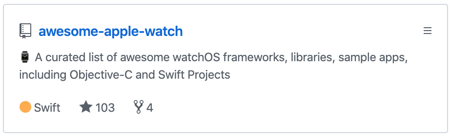

> 현재 시각 오후 12:47 (태국 현지 시간 기준) 치앙마이에서 일하기 좋은 카페 [Brain Awake](https://www.google.com/maps/place/Brain+awake/@18.7895115,98.9819849,17z/data=!3m1!4b1!4m5!3m4!1s0x30da3a9baecfffdd:0x3dcb498c9ef4386e!8m2!3d18.7895115!4d98.9841736)에서 이 글을 씁니다. 이름이 너무 마음에 듬. 아 에어팟 놓고 왔네 망했다.

> 올해 3월에 [2018년 회고](https://blog.holy.kiwi/gen/190319/)를 썼었는데 벌써 2019년 회고라니

## 🏫 여름까지 회사와 학교를 병행

2019년 3월, 학교에 복학했다. 하지만 일이 있었다. 1차 복학신청 기간을 놓쳐서 수강신청 후에 2차 복학신청 기간 때 복학 신청을 해야했다. ~~날짜를 잘못봤다.~~ 그래서 수강신청을 못했다. 당연히 ~~꿀 빠는~~ 인기 있는 수업들은 고사하고 전공필수까지 못듣게 될 상황이었다. 전공 수업 세 개를 개강 후에 겨우 GET했다. (교수님한테 찾아가서) 그리고 회사에 이번에 수업을 조금 듣게 되었으니 학교 다니면서 회사도 같이 다니고 싶다고 말했다. 회사는 OK 해주셨고 내 편의를 봐주셔서 80%의 근무만 하도록 허용해주셨다. ~~당연히 월급도 80% 히히~~ 하루는 원격으로 근무했고 토요일엔 10 to 7 FULL 근무를해서 근무시간 80%를 채웠다. 

> 토요일에 회사에 혼자 가니 무척 심심했다. ㅠㅠ (가끔 스터디 하러 오신 동료 개발자 형님 오셔서 좋았음 shout to [@knilnissim](https://github.com/knilnissim)) 토요일 오전에 사먹는 타이거슈가 꿀맛!

주로 node.js 백엔드 업무를 맡았고 그렇게 6월 종강까지 학교와 회사를 병행하면서 바쁘게 지냈다. 바쁘게 지내서 뭔가 뿌듯했지만 너무 정신없었다. 다시는 못할것 같다. ~~시험기간 벼락치기를 위해서 휴가를 써야하는 슬픔.~~ 3학년 1학기 때 전공학점을 너무 못채워서 4학년 1학기 때 빡세게 들어야한다.


<p style='text-align: center'><i>2019년 1학기 시간표</i></p>


## 🚪 회사 첫 퇴사

6월 중순에 종강하고 7월말까지 회사를 다니고 퇴사했다. 인턴 기간까지 1년 8개월동안의 내 첫 회사생활을 마쳐서 아쉬움이 더 컸다. 전역하고 바로 입사해서 그런지 제 2의 군대를 전역하는 느낌이었다. ~~문화가 군대라는 건 절대 아님. 퇴사 느낌이 그렇다는거.~~ 하지만 회사생활은 정말 재밌어서 군생활보다 훨씬 짧게 느껴졌다. 첫회사를 핀다로 오게 된건 정말 큰 행운이었다. 모두에게 배울 점들이 넘쳤고 스타트업은 정말 재밌고 성장하는 곳이라는 느낌을 뇌리에 강하게 박히도록 했다. 전역 후 회사로 오지 않고 바로 학교에 갔더라면 시야가 좁은 우물 안의 개구리 학생으로 학교 생활을 마쳤을 것이다. (학교에서는 주로 Low Level의 시스템 프로그래밍 위주로 배우기 때문)

## 🎎 사이드 프로젝트

### 군돌이 - 국민 전역일계산기 앱

[군돌이](http://onelink.to/goondori)는 [예전 포스트](https://blog.holy.kiwi/js/190127/)에서 말했듯이 2018년 8월에 `React Native`로 개발해서 9월에 런칭한 전역일계산기 앱이다. 2018년 회고글을 쓸 때만 해도 군돌이가 이렇게 클 줄 몰랐는데 2019년 4월 이후로 연예인 입대와 맞물려 급성장을 해서 현재는 누적 20만 다운로드에 달하는 애플리케이션이 되었다. (앱스토어에서 무료 라이프스타일 카테고리 3위, 전체 38위까지 랭크된 적도 있다.)

#### 2019년 군돌이 작업 내용
* 군인 최대 8명까지 등록 가능
* 13개국 언어 지원
* 테마 변경 기능
* iOS, Android 위젯 기능
* 공지사항 게시판 추가 (AWS Lambda, DynamoDB 이용)

유저와의 소통을 중요시하려고 매우 노력중이다. 플레이스토어와 앱스토어의 리뷰에 대부분 답변을 달고 있고, 이메일로 오는 문의 메일들로 소통하고 있다. 문의사항, 건의사항 등 피드백을 받다보면 여러 유저분들이 중복으로 느끼는 니즈가 있는데 (가령 몇개월 며칠 표시 기능) 유저들의 니즈를 바탕으로 작업의 우선순위를 정하고 있다.


<p style='text-align: center'><i>군돌이 활성사용자 그래프</i></p>


<p style='text-align: center'><i><a href="https://m.cafe.daum.net/SoulDresser/FLTB/121116?svc=topRank">카카오톡 FUN 메인에 뜬 군돌이 관련 글</a></i></p>

### Playground - 교내 소프트웨어 공모전 참여 (학장상)

교내 소프트웨어 공모전이 매년 8월 ~ 9월에 열리는데 이 공모전에서 은상 이상을 수상하면 졸업요건 중 하나가 채워진다. 그리고 학교 다니면서 교내 소공전은 한 번 참여해봐야 하지 않겠나 하고 1학기 초반부터 팀 빌딩을 했다. 성실한 친구들 위주로 팀을 구성했고 1학기 내내 아이디어 회의를 했다. 그렇게 해서 나온 아이디어는 **플러그인을 통해 확장하여 사용가능한 웹 대쉬보드**였다. 사용자가 HTML, CSS, Javascript를 통해 플러그인을 개발해서 플랫폼의 마켓플레이스에 업로드할 수도 있고 다른 사용자가 개발해놓은 플러그인을 개발해서 다운로드할 수 있는 웹 기반 대쉬보드 플랫폼이었다. 팀 구성은 내가 전반적인 개발을 담당했고 웹 프론트엔드 개발 1명, 백엔드 개발 1명, 디자인 1명으로 구성했다. 사용한 기술 스택은 `React`, `Typescript`, `Mobx`, `Node.js`, `Express`, `Serverless`, `AWS DynamoDB`, `AWS Lambda`였다. 처음 서버리스 프레임워크를 사용해봤는데 서버 개발이 쉽고 재밌었다. 다음에도 서버 개발할 일이 있으면 서버리스로 할 것 같다. 또 리액트로 서버에서 받아온 동적인 JS 코드를 컴포넌트에 주입할 때 어려움이 있었지만 `Function` 생성자를 통해 서드파티 모듈을 사용할 수 있도록 하는 등 삽질 후 해결했다.

참 신기한 생성자다.

```javascript
const sum = new Function('a', 'b', 'return a + b');

console.log(sum(1, 2));     // 3
```


<p style='text-align: center'><i>플레이그라운드 대쉬보드 스크린샷</i></p>

인공지능, 블록체인, 임베디드 등 상 받기 좋은 기술 없이 오로지 웹 기반으로만 개발해서 높은 상은 기대하지 않았는데 두번째로 높은 학장상을 받아서 기분이 너무 좋았다. 공모전 작품 전시할 때도 많은 분들이 칭찬해주셔서 보람 있었다. :)

프로젝트 링크: http://plgr.netlify.com/

### 2019 NAVER CAMPUS HACKDAY WINTER 참여

네이버에서 주최하는 대학생, 대학원생들만 참여할 수 있는 1박 2일 해커톤이다. 기존 해커톤 개념과는 다르게 미리 주제가 정해져 있고 참가자들은 정해져있는 주제 중에 선택해서 참가하는 방식이었다. 기본적으로 주제당 멘토는 1명, 멘티는 최대 3명이었다. 역시 네이버 해커톤이라 그런지 참가하는데에도 지원서에 쓸 내용이 많았고 코딩테스트까지 봤다. 코딩테스트를 못봐서 큰 기대를 하지 않았는데 다행히 운좋게 참가자로 선정돼서 참가할 수 있게 되었다. 사전 모임에서 멘토님께 들었는데 코딩테스트 결과는 참가자 선정에 크게 영향이 없었다고 하셨고 깃헙과 어떤 프로젝트를 했었는지 등을 최우선적으로 보셨다고 한다.

원래 주제와는 다르게 요즘 핫하게 떠오르는 프론트엔드 프레임워크인 [Svelte](https://svelte.dev/)로 컴포넌트 만들기를 하기로 했다. 아예 새로운 기술로 도전적으로 1박2일 해커톤을 하는 것이 의미 있어 보였다. 그렇게 1박 2일동안 네이버의 춘천 커넥트원에 가서 맛있는 것도 많이 먹고 스벨트로 코딩도 열심히 하고 좋은 시간을 보냈다. 무엇보다도 숙소가 대박이었다. 1인실이었고 시설이 무척 좋아서 호캉스 온 느낌이었다. ~~보안서약서를 작성해서 내부 사진은 공개하지 못합니다 ㅠ~~ 이후에 멘토님이 긍정적으로 평가해주셔서 네이버 핵데이 우수참가자 전형으로 인턴 면접을 볼 수 있었다.


### awesome-apple-watch 레포지토리 ⭐100

심심풀이로 연습삼아 애플워치 앱을 개발할 때 작성한 애플워치 관련 라이브러리와 자료 등을 모아놓은 [awesome-apple-watch](https://github.com/738/awesome-apple-watch) 레포지토리다. 별이 꾸준하게 천천히 오르다가 시험 기간에 공부하다 심심해서 해외 커뮤니티인 레딧에 레포지토리 홍보글을 올렸더니 며칠만에 ⭐100이 되었다. 문서 레포지토리라서 개발 실력과는 관련이 없지만 많은 해외 개발자들이 관심을 가지고 별을 눌러줘서 기분이 좋았다.


<p style='text-align: center'><i>awesome-apple-watch 레포지토리</i></p>

### 1일 1커밋

2018년 4월 29일부터 꾸준히 1일 1커밋을 하려고 노력하고 있다. ~~듬성듬성 빠진 잔디도 있지만.~~ 역시 1일 1커밋을 습관화하다보니 알고리즘 문제를 풀어서 올린다던가 Readme 문서를 고친다거나 하는 쓸데 없는 커밋이 늘어가고 있는 느낌이 있긴 하지만 형식적으로라도 습관화하는게 중요하다고 생각한다. ~~아님 말구~~


<p style='text-align: center'><i>1일 1커밋 잔디</i></p>

### 첫 외주

11월에 동료였던 개발자분이 외주를 소개시켜주셔서 처음으로 외주를 해봤다. 프론트엔드 개발인줄 알았지만 거의 HTML, CSS 위주의 퍼블리싱 일만 해서 좀 힘들었다. 그래도 오랜만에 회사 다니는 느낌이 나서 좋았다. 직원분들이 다 너무 잘해주셔서 즐겁게 일했다.

## 👨‍💻 코딩테스트, 면접 경험

국내 IT 대기업인 네카라(네이버, 카카오, 라인)에 한 번 쯤은 가보고 싶어서 3학년인 지금 여러 인턴십을 지원해봤다.

### 2019 카카오 개발자 겨울 인턴십 (채용연계형)

#### 코딩테스트

코딩테스트를 위해 9월부터 꾸준히 백준 온라인 저지 문제를 풀었다. 카카오 코딩테스트 열흘 전부터는 항상 도서관이나 카페에 가서 카카오 코딩테스트 기출 등 위주로 풀면서 코테를 준비했다. 대부분 고급 알고리즘보다는 시뮬레이션 유형이 많아서 가능성 있을거라 생각했다. 온라인 코테 당일날 카페에 미리 가서 몇문제를 풀면서 머리를 풀었다. 워밍업을 한 덕분에 5문제 중 1,2번은 빠른 시간 내에 풀 수 있었다. 그리고 3번은 히든케이스 하나가 말썽이었다. 4,5번은 효율성 문제였는데 5번은 의외로 솔루션이 번뜩 떠올라서 자바스크립트로 구현했는데 (본인은 코딩테스트에서 주로 자바스크립트를 이용한다.) 정확성만 통과하길래 C언어로 문법을 바꿨더니 효율성까지 통과했다. 역시 4번은 정확성만 통과되었고 효율성은 어려워서 못풀었다. PS 고인물들은 무난하게 5문제 모두 풀 수 있는 난이도였던것 같았다. 내 결과는 5문제 중 3문제 완료였는데 운좋게 커트라인에 걸쳤는지 서류 및 코딩테스트 합격 메일이 왔다. 이런 합격 메일은 거의 처음 받아본거라 기분이 좋았다.

#### 기술면접

기술면접 준비는 역시 다른 지원자들도 많이 보는 [Front End Interview Handbook](https://github.com/yangshun/front-end-interview-handbook), [Technical Interview Guidelines for beginners](https://github.com/JaeYeopHan/Interview_Question_for_Beginner) 등의 레포지토리를 위주로 준비를 많이 했다. 또한, 지금까지 한 프로젝트나 회사에서 한 일들을 위주로 예상질문들에 대한 답변들을 준비했다. 인터넷 세계에 퍼질 글이라서 정확한 세부 내용은 공개하기가 그렇지만 프론트엔드로 지원해서 주로 자바스크립트 위주의 질문이 주를 이루었다. 많은 질문들이 예상한대로 나와서 대부분 잘 대답했다고 느꼈다. 하지만 역시 카카오의 문턱은 높았다. 결과: 불합격.

### 2019 네이버 동계 인턴십 (체험형)

#### 기술면접

[위에서](#2019-naver-campus-hackday-winter-참여) 말한대로 핵데이 우수참가자로 선정되어 서류는 면제되고 바로 기술면접을 봤다. 시험기간이라 많은 준비는 못했다. 또한, 포지션이 명시되어 있지 않아서 어떤 질문이 올지 감이 안왔었다. 예상대로 질문은 정말 다양했다. 기초 CS 지식부터 백엔드, DB, 프론트엔드, 기술 외의 culture fit 질문 등 1시간 30분동안 탈탈 털렸다. 면접을 너무 못 본 느낌이라 큰 기대하지 않았는데 어떤 내 장점을 발견하셨는지 ㅠㅠ 운 좋게 합격했다. 감사합니당 :)


<p style='text-align: center'><i>2019 네이버 동계 인턴십 (체험형) 합격 메일</i></p>

### 카카오 계열사 인턴십 (채용연계형)

#### 코딩테스트

출범한지 얼마 안된 카카오 계열사다. 수시채용 인턴십 공고가 뜬 것을 본 후 바로 지원했다. 지원한지 2일 이내에 서류 통과되고 그 다음날 코딩테스트 일정이 잡혔다. 수시채용이라 해커랭크로 혼자 편한 시간에 보면 되는 방식이었다. 시험기간이었지만 빨리 결과를 보고 싶어서 코딩테스트를 응시했다. 역시 해커랭크 코딩테스트라 그런지 들은대로 난이도는 무척 낮았다. 3시간반동안 3문제 푸는것이었는데 1시간만에 풀었고 1시간동안 리팩토링했다. (세 문제 모두 자바스크립트로 풀었다.)

#### 화상 기술면접

채용프로세스가 무척 빠르게 진행되었다. 코딩테스트 합격 결과는 영업일 5일 이내에 도착했고 1~2일 후 전화로 화상 면접 일정을 잡았다. 화상 면접은 처음이었는데 나름 재밌었다. 바디랭귀지는 거의 없이 음성으로만 소통하다보니 더 집중력이 많이 필요했다. 그래도 지금까지 본 기술면접 중에는 제일 잘 본 느낌이었다. 집에서 화상면접을 진행해서 덜 긴장한 탓도 있는 것 같다. 주로 자바스크립트, 리액트, 그 외 경험에 관한 질문들이었다. 그 후 프로세스는 현장면접이다. 아직 화상 기술면접 결과를 기다리고 있다.

### 기술면접 후 느낀점

역시 면접은 많이 경험해보는 것이 승률을 높이는 것에 큰 도움을 주는 걸 느꼈다. 면접을 하면 할수록 면접 스킬이 상승하고 있다는 것을 느꼈고 어떤 방향으로 기술 면접을 준비해야할지 감이 잡혔다.

## 🏃 PT 후 몸무게 증가, 체력 상승

9월에 2년만에 다시 운동을 시작했다. 근래에 체력이 많이 떨어졌다는 것을 느꼈기 때문이다. 마침 학교 앞 PT 스튜디오에 12년지기 친구가 트레이너로 일하고 있어서 딱 좋았다. 지인 DC를 받고 학교 다니는 3개월동안 PT와 식단관리를 받았다. 벤치프레스, 스쿼트, 데드리프트, 랫풀다운, 숄더프레스, 브이싯업 등 다양한 운동을 올바른 자세로 배울 수 있는 점이 좋았다. ~~무지 비싸지만.~~ 그리고 혼자라면 절대 못할 양의 운동을 억지로라도 하니까 매우 고통스럽고 힘들었지만 하고 나면 기분이 좋았다. 그렇게 근력 운동과 런닝 머신 운동을 통해 체력이 좋아진 것을 체감했고 하루 4~5끼 식단을 통해 3개월동안 6~7kg 정도 찌울 수 있었다.

## ✈️ 여행

회사에서 돈도 벌었겠다. 모은 돈으로 시간 날 때마다 해외 여행을 다니고 있다. 한살이라도 젊을 때 많이 가야 나중에 후회하지 않을 것 같다.

### 🇻🇳 1월 베트남 다낭 (10일)

설날 껴서 휴가 3일 내고 다녀왔다. 곧 군대가는 친구랑 5일 지내고 혼자 5일 지냈다. 혼자 5일 지내는 동안 카페에서 다른 스위스인 디지털노마드 형님을 알게 되어서 좋았다. 역시 겨울에는 동남아시아가 최고다. ~~서울은 너무 추워;~~


<p style='text-align: center'><i>다낭 용다리</i></p>

### 🇭🇺 8월 헝가리 부다페스트 한달살기 (28일) (+ 🇸🇰, 🇦🇹)
7월 31일에 퇴사하고 항상 내가 노래 부르던 한달살기를 드디어 실천했다. 부다페스트로 선택한 이유는 여름이라서 동남아시아는 무조건 싫었고 [nomadlist](https://nomadlist.com/)에서 부다페스트가 꽤 상위 랭크에 있었기 때문이다. 역시 동유럽이라서 물가도 괜찮은 편이었고 도시 자체도 무척 예쁘고 이국적이어서 좋은 선택이었다. 한달살기 초반에는 인터넷 속도도 느리고 버스 타는 것도 적응이 안되고 힘들어서 한국으로 돌아가고 싶었지만 적응할수록 떠나는게 아쉬웠다. 도시 자체가 작아서 금방 길이 익숙해지고 마음에 들었다. 트램도 멋졌고 강도 아름답고 밤에 야경 보는 것도 무척 좋았다. 중간에 2박 3일로 슬로바키아, 오스트리아도 잠깐 다녀왔는데 특별한 경험이었다. 주 3~4일은 여행하고 3~4일은 카페에 가서 군돌이 작업 등 개발을 했다. (카페는 [California Coffee Company](https://www.google.com/maps/place/California+Coffee+Company/@47.489623,19.0615672,17.43z/data=!4m8!1m2!2m1!1scalifornia+coffee+company!3m4!1s0x0:0xeff03b72e92b66a8!8m2!3d47.4901447!4d19.0623951)었고 일하기 좋은 카페로 추천!) 제일 궁금할 부분인 비용은 항공, 숙박, 슬로바키아, 오스트리아 간 것까지 다 포함해서 총 250만원 정도 지출했다. 요리를 해먹거나 항공권 등을 충분히 더 싸게 구하면 더 줄일 수 있을 것 같다.


<p style='text-align: center'><i>부다페스트 국회의사당</i></p>

### 🇹🇭 12월 태국 치앙마이 (10일) - 진행중

현재 나는 어제(크리스마스 이브) 태국 치앙마이에 도착했다. 원래 지원한 인턴십이 다 떨어지면 1월에 치앙마이 한달살기, 2월에 발리 한달살기를 하려고 했는데 생각지도 않게 네이버에서 불러주셔서 첫출근 전까지 크리스마스와 새해는 치앙마이에서 보내기로 했다. 새해 카운트다운을 외국에서 하는 것이 내 버킷리스트이기도 했다. 아직 태국이란 나라에 적응중이라 힘들지만 많이 힘들어야 좋은 추억이 되는 것 같다. ~~하하 :)~~


<p style='text-align: center'><i>현재 치앙마이 카페 글 마무리 순간; 쓰는데 5시간 걸렸다 으아</i></p>

## 🥝 2019년을 보내며

### 요약

* 1년 8개월 회사 다니고 퇴사함
* 3학년 복학함
* 군돌이 여러 기능 추가했고 다운로드 수 많이 늘어남
* 교내 소프트웨어 공모전 학장상 수상함
* 네이버 핵데이 참여함
* 기술면접 세번 봄
* 5개국 다녀왔고 한 도시에서 한달 정도 지내봄

올해 별로 한 것 없이 지나갔다고 느꼈는데 막상 적어보니 뭔가 많다. 학교 공부하고 ~~별로 하지도 않았지만~~ 군돌이 이런저런 기능 추가하고 이것저것 뭐든지 하느라 막상 내가 공부하고 싶은 기술에 대한 깊은 공부를 하는 시간이 좀 부족했던 것 같다. 내년에는 내가 정한 방향인 프론트엔드 기술을 더 깊게 공부하고 싶고 그걸 바탕으로 더 재밌는 토이 프로젝트들 많이 하고 싶다. 🥝
