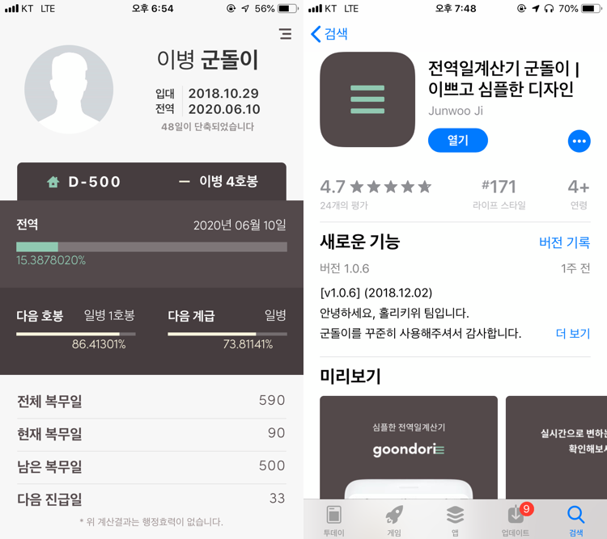
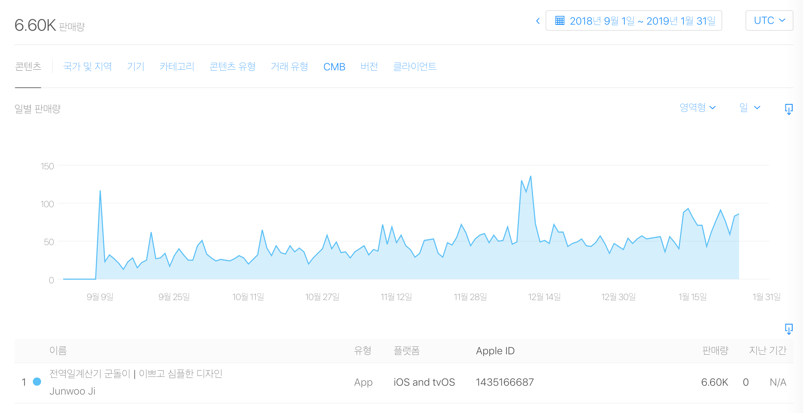
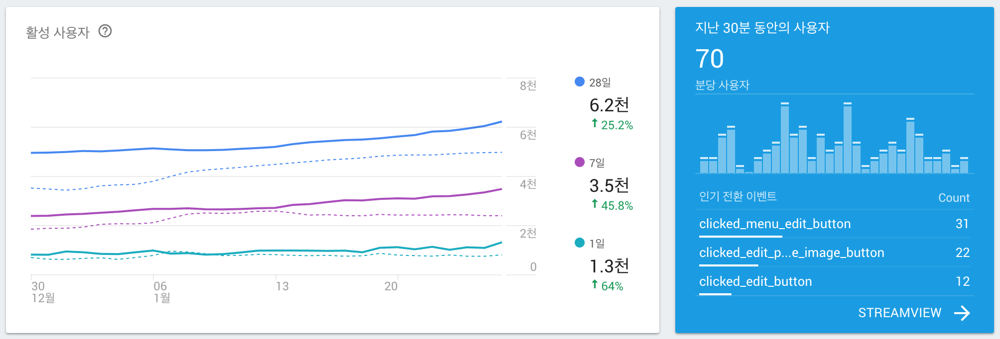

<!-- 2018년 9월 스위프트로 간단한 전역일계산기 앱을 만들기로 구상. 간단할 줄 알았는데 date 계산 등 스위프트에 익숙하지 않아 난항을 겪음. react와 js에 익숙해 react-native를 사용하여 안드로이드와 iOS를 둘다 잡을 수 있는 react-native로 개발하기로 결정. css의 flexbox를 이용한 반응형 디자인은 정말 매력적임. 웹뷰를 개발하는 느낌이지만 react-native는 네이티브 API를 사용하여 네이티브에서 직접 렌더링하기 때문에 웹뷰가 아니기 때문에 네이티브와 같은 사용성을 보여줌. typescript, styled-components 라이브러리를 추가해서 개발환경을 세팅함. 처음에 expo로 개발을 시작하였으나 큰 용량과 native 모듈 링크 문제로 expo eject. 많은 도움이 된 레포지토리 jondot/awesome-react-native에서 알맞은 rn 모듈을 찾아쓸 수 있었다. dropdown, image crop, fastimage, async storage. react-native-awesome-starter와 react-native-trouble-shooting 레포지토리를 개설하여 운영중. 처음에 상태관리라이브러리를 redux를 사용하였지만 더 간단하다고 알려져있는 mobx로 뜯어고침 -->

<i>전역일계산기 앱 군돌이</i>

2018년 9월 3일에 전역일계산기 앱 [군돌이](http://onelink.to/sqc7wh)를 구글 플레이스토어에 처음으로 런칭하고, 그로부터 6일 후인 9월 9일에 추가로 애플 앱스토어에 런칭했다. 런칭한 이후로 어떤 블로그 플랫폼이던 react-native로 앱을 개발하고 안드로이드와 iOS 플랫폼에 모두 런칭했던 이야기를 공유하고 싶었다. (~~별거 아닌 앱이지만...~~) 하지만 귀차니즘으로 작성하지 못했다. 그래서 군돌이 앱의 만 명 설치를 핑계로 react-native로 하이브리드 모바일 애플리케이션을 개발한 후기를 작성해보려한다. 

## 💫 시작

우선, 내가 개발한 앱을 소개하겠다. 간단히 전역일을 계산할 수 있는 애플리케이션이다. 다른 앱과의 차별점을 둔 것은 예쁘고 심플한 디자인과 사용성이다. 현역 생활 때 사용한 타 앱은 많은 유저들이 사용하는 것에 반해 사용성이 많이 부족하다고 느꼈다. 그래서 직접 전역일계산기 앱을 개발해서 현역 군인들과 고무신분들, 부모님들이 더 예쁘고 심플한 디자인의 전역일계산기를 사용하게 하고 싶었다. 물론 디자인은 똥손인 내가 하지 않았고 금손 디자이너 GOM님이 팀원으로써 도와주셨다. (감사합니다! 🥝)

런칭한지 대략 4개월이 지나지 않았는데 2019년 1월 25일 금요일 기준 안드로이드 3,400명 설치, iOS 6,600명이 설치하여 총 10,000명의 유저가 설치했고, 하루에 1,000명 ~ 1,300명 정도가 사용하는 전역일계산기 앱이 되었다. 구글 플레이스토어의 ASO가 더 좋음에도 불구하고 앱스토어의 설치량이 항상 더 좋은 것이 약간 놀라웠는데 아마 젊은 층의 여성분들이 아이폰을 많이 사용하기 때문이리라 짐작했다. 회사에 다니면서 사이드 프로젝트로 퇴근하고 저녁에 그리고 주말에 틈틈이 작업한 앱을 생각보다 많은 분들이 사용해주셔서 엄청 보람 있었다. 대략 앱을 만들고 처음 배포하기까지 보름 정도 걸렸는데 그 과정과 사용했던 라이브러리 등 그리고 RN으로 개발하면서 느꼈던 장점, 단점 정도를 써보겠다.

<i>앱스토어 판매량</i>

<i>파이어베이스 애널리틱스 대쉬보드</i>

## ⚛ 왜 react-native로 개발하였나

처음에는 패기에 가득차서 간단한 앱이니 swift로 iOS 앱을 개발하고, java나 kotlin으로 안드로이드 앱을 개발하면 되겠다싶어서 swift로 전역일계산기 앱을 구상하고 프로토타입을 개발해보았다. 간단할 줄 알았지만 date 계산 등 swift의 언어적 특징에 많이 익숙하지 않아 많은 난항을 겪었다. 그래서 자연스레 javascript를 사용하는 react-native에 눈을 돌리게 되었다. react와 javascript에는 웬만큼 자신이 있었고 한 번 개발해놓으면 iOS와 안드로이드, 두 플랫폼에서 작동하기 때문에 react-native는 내가 생각하기에 최고의 선택이었다.

[react-native 공식 웹사이트](https://facebook.github.io/react-native/)를 참고해 공부하면서 개발했는데 웹 프론트엔드 개발하듯이 모바일 앱을 개발하는 개발 경험이 신세계였다. 게다가 expo를 사용하면 굳이 테스트 기기를 유선으로 연결하지 않고, expo 앱을 설치해서 QR코드로 인식하면 내가 개발하고 있는 앱을 실시간으로 확인해보며 개발할 수 있어서 네이티브를 직접 개발할 때와는 생산성과 편의성이 말도 안되게 차이가 났다. 이래서 RN RN 하는 구나 느꼈다. 그리고 모바일 앱의 반응형 디자인을 내가 가장 좋아하는 CSS의 flexbox를 사용해 처리하는 것 때문에 매력적이었다. 개발경험에 있어서 네이티브를 개발한다는 느낌보다는 웹뷰를 개발하는 느낌이지만 react-native는 네이티브 API를 사용하여 네이티브에서 직접 렌더링하기 때문에 네이티브와 유사한 성능, 사용성을 보여준다.

## ⚒ 개발환경 설정

처음에는 위에서 말했듯이 expo라는 react-native를 편하게 개발할 수 있도록 도와주는 서드파티 툴을 사용했다. 하지만 점점 더 많은 기능을 추가하면서 expo의 한계를 느꼈다. 일단 앱의 용량이 비정상적으로 컸고, 무엇보다 네이티브 모듈을 `react-native link` 할 수 없다는게 엄청난 단점이었다. 그래서 결국 `expo eject` 명령어를 통해 expo를 떼어냈다. 떼어내려면 힘들줄 알았는데 expo 관련 라이브러리를 쓰지 않아서 그런지 저 명령어를 통해 eject하고 빌드도 잘되었던 기억이 난다. 위 경험을 통해 처음부터 웬만하면 expo를 사용하지 않는 것이 좋다고 판단하여 다음 RN 프로젝트부터는 expo를 사용하지 않았다. 다른 분들에게도 그렇게 추천하고 있다.

또한, 추가적으로 정적 타이핑을 위해 `typescript`를 사용하였고, 더 편한 스타일링을 위해 `styled-components`를 사용하였다. 그리고 처음에는 상태관리 라이브러리로 `redux`를 사용했지만 `mobx`의 간편성에 반해서 중간에 `mobx`로 뜯어고치는 과정을 거쳐서 좀 빡셌다. 이러한 개발환경을 세팅할 때, 정말 오래 걸리고 매번 찾는게 번거로워서 [react-native-awesome-starter](https://github.com/JonJee/react-native-awesome-starter)라는 레포지토리를 생성해서 초기에 RN의 개발환경 세팅하는 방법들을 정리해놓았다.

## 🙋 꼭 써야한다고 생각하는 라이브러리들

## 🌠 트러블 슈팅

react-native를 개발하면서 iOS는 x-code에서 직접 빌드하고, 안드로이드는 안드로이드 스튜디오에서 직접 빌드할 일이 많았다. 그리고 여러 네이티브 모듈을 사용하다보니 삽질할 일이 정말 많았다. 빌드 에러가 정말 많이 났다. 그래서 짧은 기간동안 RN으로 개발하면서 발생했던 에러들을 [react-native-trouble-shooting](https://github.com/JonJee/react-native-trouble-shooting) 레포지토리에 정리해놓았다.

> 혹시 에러가 발생한다면 참고해주시면 좋을 것 같습니다. 레포지토리에 Trouble Shooting이라면 Pull Request 부탁드립니다.

최근에 가장 기억이 남는 트러블 슈팅 중에 하나는 iOS 위젯을 개발할 때였다. 유저분들의 위젯 기능 요청이 너무 많아서 큰 부담을 갖고 위젯 기능을 개발하고 있었는데 위젯 익스텐션에서 앱에 저장되어있는 데이터를 가져오는 부분이 정말 어려웠고, 몇 주째 삽질만 하고 있었다. iOS의 위젯을 개발하기 위해서는 당연히 iOS 개발 관련 지식도 필요했고, 계속 digging을 했다. 일단 RN에서 iOS의 위젯을 추가하려면 [react-native-today-widget](https://github.com/matejkriz/react-native-today-widget) 라이브러리를 사용해야했고, 군돌이 앱의 메인과 today widget extension 간의 데이터를 공유하려면 iOS의 App Group이라는 개념을 사용해야 했다. 그래서 [react-native-shared-group-preferences](https://github.com/KjellConnelly/react-native-shared-group-preferences) 라이브러리도 사용해야했다. 위젯 코드에서 `SharedGroupPreferences`를 import하고 `getItem`이라는 `static` 함수를 사용해야 했는데 `getItem`이라는 함수는 콘솔에 잘찍히는 것을 확인했지만 정작 사용할 떄에는 `SharedGroupPreferences`가 `undefined`라는 에러가 나오는 상황이어서 진짜 포기하기 일보 직전이었다. 많은 것을 시도해보았고 많은 시간이 흘렀다. 지푸라기를 잡는 심정으로 해당 레포지토리의 이슈를 보았는데 [내 상황과 비슷한 이슈](https://github.com/KjellConnelly/react-native-shared-group-preferences/issues/3)가 있었다. 답변 중 하나가 link가 안되었을 것이라는 답변이었다. 하지만 나는 link가 잘되어있는 것을 확인해서 그 문제는 아닐 것이라고 생각한게 오산이었다. 앱 메인에는 해당 라이브러리가 link되어있었지만 today widget extension에는 이 라이브러리가 link가 안되어있었어서 `SharedGroupPreferences`를 사용할 수 없었던 것이다. today widget extension에 `react-native-shared-group-preferences` 라이브러리를 직접 link하니 정상적으로 작동했다! 다행히 문제에 대한 solution을 발견하고 다리 쭉 뻗고 잘 수 있었다. ☁ [내가 남긴 댓글](https://github.com/KjellConnelly/react-native-shared-group-preferences/issues/3#issuecomment-457814798)

## 💁 내가 생각하는 react-native의 장점

## 🙅 내가 생각하는 react-native의 단점

## 🐘 도움이 되었던 라이브러리 혹은 자료들

* [awesome-react-native](https://github.com/jondot/awesome-react-native)

react-native에서 필요한 적재적소의 라이브러리를 나열해놓은 레포지토리다. RN으로 개발할 때 가장 많이 방문했던 레포지토리일 것이다. 

