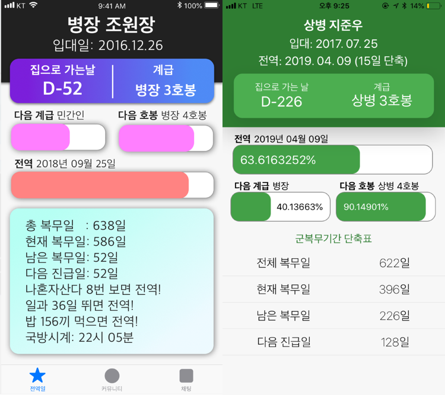

<i>전역일계산기 앱 군돌이</i>

2018년 9월 3일에 전역일계산기 앱 [군돌이](http://onelink.to/sqc7wh)를 구글 플레이스토어에 처음으로 런칭하고, 그로부터 6일 후인 9월 9일에 추가로 애플 앱스토어에 런칭했다. 런칭한 이후로 어떤 블로그 플랫폼이던 react-native로 앱을 개발하고 안드로이드와 iOS 플랫폼에 모두 런칭했던 이야기를 공유하고 싶었다. (~~별거 아닌 앱이지만...~~) 하지만 귀차니즘으로 작성하지 못했다. 그래서 군돌이 앱의 만 명 설치를 핑계로 react-native로 하이브리드 모바일 애플리케이션을 개발한 후기를 작성해보려한다. 

## 💫 시작

우선, 내가 개발한 앱을 소개하겠다. 간단히 전역일을 계산할 수 있는 애플리케이션이다. 다른 앱과의 차별점을 둔 것은 예쁘고 심플한 디자인과 사용성이다. 현역 생활 때 사용한 타 앱은 많은 유저들이 사용하는 것에 반해 사용성이 많이 부족하다고 느꼈다. 그래서 직접 전역일계산기 앱을 개발해서 현역 군인들과 고무신분들, 부모님들이 더 예쁘고 심플한 디자인의 전역일계산기를 사용하게 하고 싶었다. 물론 디자인은 똥손인 내가 하지 않았고 금손 디자이너 GOM님이 팀원으로써 도와주셨다. (감사합니다! 🥝)

런칭한지 대략 4개월이 지나지 않았는데 2019년 1월 25일 금요일 기준 안드로이드 3,400명 설치, iOS 6,600명이 설치하여 총 10,000명의 유저가 설치했고, 하루에 1,000명 ~ 1,300명 정도가 사용하는 전역일계산기 앱이 되었다. 구글 플레이스토어의 ASO가 더 좋음에도 불구하고 앱스토어의 설치량이 항상 더 좋은 것이 약간 놀라웠는데 아마 젊은 층의 여성분들이 아이폰을 많이 사용하기 때문이리라 짐작했다. 회사에 다니면서 사이드 프로젝트로 퇴근하고 저녁에 그리고 주말에 틈틈이 작업한 앱을 생각보다 많은 분들이 사용해주셔서 엄청 보람 있었다. 대략 앱을 만들고 처음 배포하기까지 보름 정도 걸렸는데 그 과정과 사용했던 라이브러리 등 그리고 RN으로 개발하면서 느꼈던 장점, 단점 정도를 써보겠다.

<i>앱스토어 판매량</i>

<i>파이어베이스 애널리틱스 대쉬보드</i>

## ⚛ 왜 react-native로 개발하였나

처음에는 패기에 가득차서 간단한 앱이니 swift로 iOS 앱을 개발하고, java나 kotlin으로 안드로이드 앱을 개발하면 되겠다싶어서 swift로 전역일계산기 앱을 구상하고 프로토타입을 개발해보았다. 간단할 줄 알았지만 date 계산 등 swift의 언어적 특징에 많이 익숙하지 않아 많은 난항을 겪었다. 그래서 자연스레 javascript를 사용하는 react-native에 눈을 돌리게 되었다. react와 javascript에는 웬만큼 자신이 있었고 한 번 개발해놓으면 iOS와 안드로이드, 두 플랫폼에서 작동하기 때문에 react-native는 내가 생각하기에 최고의 선택이었다.

[react-native 공식 웹사이트](https://facebook.github.io/react-native/)를 참고해 공부하면서 개발했는데 웹 프론트엔드 개발하듯이 모바일 앱을 개발하는 개발 경험이 신세계였다. 게다가 expo를 사용하면 굳이 테스트 기기를 유선으로 연결하지 않고, expo 앱을 설치해서 QR코드로 인식하면 내가 개발하고 있는 앱을 실시간으로 확인해보며 개발할 수 있어서 네이티브를 직접 개발할 때와는 생산성과 편의성이 말도 안되게 차이가 났다. 이래서 RN RN 하는 구나 느꼈다. 그리고 모바일 앱의 반응형 디자인을 내가 가장 좋아하는 CSS의 flexbox를 사용해 처리하는 것 때문에 매력적이었다. 개발경험에 있어서 네이티브를 개발한다는 느낌보다는 웹뷰를 개발하는 느낌이지만 react-native는 네이티브 API를 사용하여 네이티브에서 직접 렌더링하기 때문에 네이티브와 유사한 성능, 사용성을 보여준다.

## ⚒ 개발환경 설정

처음에는 위에서 말했듯이 expo라는 react-native를 편하게 개발할 수 있도록 도와주는 서드파티 툴을 사용했다. 하지만 점점 더 많은 기능을 추가하면서 expo의 한계를 느꼈다. 일단 앱의 용량이 비정상적으로 컸고, 무엇보다 네이티브 모듈을 `react-native link` 할 수 없다는게 엄청난 단점이었다. 그래서 결국 `expo eject` 명령어를 통해 expo를 떼어냈다. 떼어내려면 힘들줄 알았는데 expo 관련 라이브러리를 쓰지 않아서 그런지 저 명령어를 통해 eject하고 빌드도 잘되었던 기억이 난다. 위 경험을 통해 처음부터 웬만하면 expo를 사용하지 않는 것이 좋다고 판단하여 다음 RN 프로젝트부터는 expo를 사용하지 않았다. 다른 분들에게도 그렇게 추천하고 있다.

또한, 추가적으로 정적 타이핑을 위해 `typescript`를 사용하였고, 더 편한 스타일링을 위해 `styled-components`를 사용하였다. 그리고 처음에는 상태관리 라이브러리로 `redux`를 사용했지만 `mobx`의 간편성에 반해서 중간에 `mobx`로 뜯어고치는 과정을 거쳐서 좀 빡셌다. 이러한 개발환경을 세팅할 때, 정말 오래 걸리고 매번 찾는게 번거로워서 [react-native-awesome-starter](https://github.com/JonJee/react-native-awesome-starter)라는 레포지토리를 생성해서 초기에 RN의 개발환경 세팅하는 방법들을 정리해놓았다.

## 💻 개발 과정

<i>군돌이 초안(왼쪽)과 프로토타입(오른쪽)</i>

사실 전역일계산기 앱에 기능이 많이 없어서 과정이랄게 있을까 싶긴 하지만 써보도록 하겠다. 우선 다른 앱들을 벤치마킹하고 어떤 내용들을 어떻게 표시하면 좋을지 생각을 해서 조잡하게 wireframe 삼아서 스케치로 대충 그려보았다. 바로 위의 왼쪽 사진이다. 현재의 디자인과 완전 다르다...! (감사합니다. 디자이너님, 저런 garbage를 심폐소생술시켜주셔서 ㅎㅎ) wireframe을 가지고 react-native로 앱 구조를 어떻게 구성할지 고민하고 프로토타입(오른쪽 사진)을 개발했다. 그 후, 디자이너님께 프로토타입을 드리고 바로 맨 위의 스크린샷과 같은 디자인을 주셨다. 컴포넌트 구조를 그래도 잘 해놓아서 디자인을 시안대로 그리는 것은 쉽게 했다. 그리고 편집 화면도 모달로 추가해서 기본적인 기능을 갖춘 다음에 바로 구글 플레이스토어와 앱스토어 개발자 계정을 구입해서 배포 준비를 했다. 개발자 계정이 비쌈에도 굳이 빨리 구입을 해서 추진했던 이유는 이렇게라도 하지 않으면 프로젝트가 느슨해질 것 같았고 출시가 계속 더뎌질 것 같아서였다. 일단 내 목표는 기본 기능만 가진 예쁘고 심플한 전역일계산기 앱을 만들고 그 후에 버그도 고치고 기능도 추가할 계획이었다.

## 🌠 트러블 슈팅

react-native를 개발하면서 iOS는 x-code에서 직접 빌드하고, 안드로이드는 안드로이드 스튜디오에서 직접 빌드할 일이 많았다. 그리고 여러 네이티브 모듈을 사용하다보니 삽질할 일이 정말 많았다. 빌드 에러가 정말 많이 났다. 그래서 짧은 기간동안 RN으로 개발하면서 발생했던 에러들을 [react-native-trouble-shooting](https://github.com/JonJee/react-native-trouble-shooting) 레포지토리에 정리해놓았다.

> 혹시 에러가 발생한다면 참고해주시면 좋을 것 같습니다. 레포지토리에 Trouble Shooting이라면 Pull Request 부탁드립니다.

최근에 가장 기억이 남는 트러블 슈팅 중에 하나는 iOS 위젯을 개발할 때였다. 유저분들의 위젯 기능 요청이 너무 많아서 큰 부담을 갖고 위젯 기능을 개발하고 있었는데 위젯 익스텐션에서 앱에 저장되어있는 데이터를 가져오는 부분이 정말 어려웠고, 몇 주째 삽질만 하고 있었다. iOS의 위젯을 개발하기 위해서는 당연히 iOS 개발 관련 지식도 필요했고, 계속 digging을 했다. 일단 RN에서 iOS의 위젯을 추가하려면 [react-native-today-widget](https://github.com/matejkriz/react-native-today-widget) 라이브러리를 사용해야했고, 군돌이 앱의 메인과 today widget extension 간의 데이터를 공유하려면 iOS의 App Group이라는 개념을 사용해야 했다. 그래서 [react-native-shared-group-preferences](https://github.com/KjellConnelly/react-native-shared-group-preferences) 라이브러리도 사용해야했다. 위젯 코드에서 `SharedGroupPreferences`를 import하고 `getItem`이라는 `static` 함수를 사용해야 했는데 `getItem`이라는 함수는 콘솔에 잘찍히는 것을 확인했지만 정작 사용할 때에는 `SharedGroupPreferences`가 `undefined`라는 에러가 나오는 상황이어서 진짜 포기하기 일보 직전이었다. 많은 것을 시도해보았고 많은 시간이 흘렀다. 지푸라기를 잡는 심정으로 해당 레포지토리의 이슈를 보았는데 [내 상황과 비슷한 이슈](https://github.com/KjellConnelly/react-native-shared-group-preferences/issues/3)가 있었다. 답변 중 하나가 link가 안되었을 것이라는 답변이었다. 하지만 나는 link가 잘되어있는 것을 확인해서 그 문제는 아닐 것이라고 생각한게 오산이었다. 앱 메인에는 해당 라이브러리가 link되어있었지만 today widget extension에는 이 라이브러리가 link가 안되어있었어서 `SharedGroupPreferences`를 사용할 수 없었던 것이다. today widget extension에 `react-native-shared-group-preferences` 라이브러리를 직접 link하니 정상적으로 작동했다! 다행히 문제에 대한 solution을 발견하고 다리 쭉 뻗고 잘 수 있었다. ☁ [내가 남긴 댓글](https://github.com/KjellConnelly/react-native-shared-group-preferences/issues/3#issuecomment-457814798)

## 🙋 꼭 써야한다고 생각하는 라이브러리

* [react-native-code-push](https://github.com/Microsoft/react-native-code-push)

Microsoft에서 만든 code push는 react-native를 사용하는 이유에도 포함되어있을 정도로 아주 강력한 기능이다. 네이티브 바이너리 파일의 업데이트 없이 간단한 명령어만으로 앱을 업데이트시킬 수 있는 기능이다. code push의 원리는 네이티브 파일에서 로컬이 아닌 code push 서버에 있는 자바스크립트 번들 파일을 바라보고 있다가 개발자가 code push 명령어를 통해 자바스크립트 번들 파일을 교체하면 앱이 업데이트된 것처럼 보이는 원리이다. 물론, 네이티브 모듈을 추가한 것은 코드 푸쉬로 적용이 안된다. 그 때에는 직접 업데이트를 해줘야한다. 하지만 계속 코드 푸쉬를 사용해서 업데이트하는 건 좋지 않다고 생각한다. 왜냐하면 바이너리를 얼마나 꾸준히 업데이트하는 지도 ASO에 영향이 미쳐지기 때문이다.

* [react-native-firebase](https://github.com/invertase/react-native-firebase)

react-native에서 firebase를 사용할 수 있도록 도와주는 라이브러리이다. 내가 주로 사용한 부분은 analytics의 event이다. 유저가 특정 액션을 취했을 때, firebase에서 event를 tracking해서 유저가 어떤 플로우를 취하는지 볼 수 있고, funnel을 통해 어디서 bounce rate(이탈률)가 많이 발생하는지 볼 수 있는 등 제공하는 통계 기능이 많다. 위의 firebase 스크린샷은 analytics의 대쉬보드이다. 추가적으로 admob을 사용해 광고 배너를 달 수 있는데, react-native-firebase를 사용할 수도 있지만 더 편리하게 쓸 수 있게 제공해주는 [react-native-admob](https://github.com/sbugert/react-native-admob)을 사용했다. 또한 cloud messaging을 통해 푸쉬 알림을 보내는 기능을 해보고 싶었지만 한 번 삽질하다가 안되서 보류중이다. 어쨌든 `analytics` 기능만으로도 [invertase](https://invertase.io) 팀의 `react-native-firebase` 라이브러리는 react-native를 한다면 꼭 써야하는 라이브러리이다.

* [react-native-fast-image](https://github.com/DylanVann/react-native-fast-image)

react-native-fast-image 라이브러리는 react-native에서 기본적으로 제공하는 `<Image />` 컴포넌트를 사용해도 되지만 react-native-fast-image의 `<FastImage />`를 사용하면 이름 그대로 더 빠르게 이미지를 렌더할 수 있다. 주기능으로는 이미지 캐쉬하기, authorization headers를 추가하기, 이미지 미리 로드하기, 이미지 우선순위 매기기 등이 있다. iOS의 이미지 로드 라이브러리인 [SDWebImage](https://github.com/SDWebImage/SDWebImage)와 Android의 이미지 로드 라이브러리인 [glide](https://github.com/bumptech/glide)를 플랫폼마다 직접 사용하여 성능을 높였다. 따라서 많은 이미지를 렌더할 일이 있다면, react-native에서 `react-native-fast-image` 라이브러리의 사용은 필수다.

## ⚽ 재밌는 라이브러리

* [react-native-egg](https://github.com/FuYaoDe/react-native-egg)

react-native-egg는 이스터에그를 심어놓기 위해 사용하는 라이브러리이다. 아직 사용은 안해봤지만 앱 안의 비밀스러운 제스쳐를 숨겨놓고 개발을 위한 테스트모드로 진입하게 하거나, 유저들이 우연히 발견한다면 재미 요소를 느낄만한 이스터에그를 숨겨놓을 수 있다. 군돌이 앱에도 나중에 이 라이브러리를 사용해서 이스터에그를 숨겨놓을 생각이다.

* [react-native-haptic](https://github.com/AppAndFlow/react-native-haptic)

아이폰의 약한 진동인 햅틱을 구현해놓은 아주 좋은 react-native 라이브러리이다. 유저가 버튼을 누를 때, 피드백을 주는 데 햅틱만큼 좋은게 없다고 생각한다. 이 라이브러리를 사용하면 아주 손쉽게 react-native에서 햅틱 효과를 줄 수 있다. 대신 안드로이드는 지원하지 않기 때문에, `Platform.OS`로 분기 처리해주어야 한다.

## 💁 내가 생각하는 react-native의 장점

짧게나마 군돌이 앱을 react-native로 개발해보면서 많은 삽질이 있었지만 정말 좋은 개발 경험을 했다. 무엇보다도 자바스크립트로 네이티브 앱과 사용성, 성능이 거의 동일한 앱을 만들 수 있는 것은 정말 신세계였다. 게다가 iOS와 안드로이드 두 플랫폼에서 돌아가다니... react-native의 광팬이 된 것 같다. 내가 생각하는 react-native의 장점은 다음과 같다.

1. 생산성이 엄청 높다.

Cake 앱의 이성민 개발자님이 Cake 앱을 안드로이드와 iOS 두 플랫폼의 앱을 혼자서 한 달만에 개발하고 출시하셨다고 한다. 만약에 안드로이드와 iOS 각각 개발을 했다면 인원과 시간 등 리소스가 더 필요했을 것인데 react-native였기에 가능했다. 한 가지 소스코드로 안드로이드와 iOS의 코드를 공유하게 되니 생산성도 높아지고 마찬가지로 유지보수 비용이 현저히 낮아진다. 또한, 안드로이드와 iOS는 코드를 고치고 확인할 때마다 빌드하면 꽤 오랜시간을 잡아먹는데에 반해 react-native는 live reload 기능을 통해서 코드를 고칠 때마다, 바로바로 수정사항을 확인할 수 있어서 엄청 편하고 빠르게 개발할 수 있다.

2. learning curve(학습 곡선)가 비교적 짧다.

Javascript, CSS 그리고 React가 익숙하다는 전제 하에 react-native의 learning curve는 말도 안되게 짧다. JS, React가 능숙하다면 react-native를 직접 개발하면서 모르는 것을 그때그때마다 찾아보며 능숙해지는 것도 좋은 방법인 것 같다. ~~많은 삽질이 필요하겠지만~~

3. 라이브러리가 적지 않다. ~~필요하면 직접 만들면 된다~~

밑에서 한 번 더 언급하겠지만 [awesome-react-native](https://github.com/jondot/awesome-react-native)를 보면 필요한 라이브러리가 많이 만들어져 있어서 개발하는데 거의 문제가 없었다. 또한, 아주 방대한 [npm](https://www.npmjs.com) 모듈들을 마음껏 설치해서 사용할 수 있는 점도 큰 장점 중 하나이다. 네이티브 관련 라이브러리가 안드로이드와 iOS 라이브러리보다야 훨씬 적겠지만 경쟁하고 있는 하이브리드 앱 프레임워크인 [flutter](https://flutter.io/)보다는 라이브러리가 많다. 혹시 필요한 라이브러리가 없다면 직접 [create-react-native-library](https://github.com/frostney/react-native-create-library)를 통해 라이브러리를 개발할 수 있다. (물론 Android, iOS 플랫폼에서 돌아가도록 직접 코드를 작성해야해서 많은 어려움이 있지만 말이다.)

4. code push를 통한 빠른 배포

위에서 말했지만 code push는 react-native를 사용하는 큰 이유 중 하나이다. 며칠씩 걸리는 iOS 심사 및 배포를 생략하고 몇 초만에 배포할 수 있는 점은 아주 강력하다.

## 🙅 내가 생각하는 react-native의 단점

react-native의 팬이지만 아쉬운 점이 있다면 다음과 같다.

1. 위젯이나 워치 익스텐션을 개발하기가 네이티브보다 까다롭다.

안드로이드 위젯은 [react-native-android-widget-poc](https://github.com/netbeast/react-native-android-widget-poc), iOS 위젯은  [react-native-today-widget](https://github.com/matejkriz/react-native-today-widget), 애플워치 앱은 [react-native-watch-connectivity](https://github.com/mtford90/react-native-watch-connectivity), 또한 앱 간의 데이터 공유는 [react-native-shared-group-preferences](https://github.com/KjellConnelly/react-native-shared-group-preferences) 라이브러리를 사용하는 등 많은 라이브러리들이 오픈소스로 개발되고 있지만 아무래도 네이티브의 새로운 API들이 나오면 바로바로 지원되는 것은 어렵기 때문에 스마트워치 앱이나 위젯 같은 다른 확장 기능을 사용해야 한다면 `react-native`는 추천하지 않는다. react-native로 iOS 위젯을 개발하고 있지만 메모리 문제인지 가끔 "로드할 수 없음" 이라고 뜨는 문제가 있어서 살짝 불안정한 점이 보인다.

2. 호환성 문제로 빌드가 안될 때가 있어 삽질 요소가 많다.

react-native 라이브러리를 많이 link시키다가 보면 라이브러리들이 꼬일 때가 있고, 시뮬레이터 기기에서 작동을 안하는 등 해결방법을 찾기 어려운 트러블이 발생하기 쉽다. 내가 아직 초보라서 못찾는 것일 수도 있긴 하지만, 불친절한 에러메세지도 많고 해서 안드로이드 혹은 iOS 빌드가 안될 때에는 많은 시간의 폭풍 구글링과 시행착오를 요한다. (이는 내공이 쌓이면 해결될 것 같다.)

3. 한국어로 된 자료가 많이 부족하다.

react-native 관련 서적이 한국에 출판된 게 2~3권 밖에 보이지 않고, 한국의 react-native 커뮤니티가 작아서 그런지 한국어로 된 개발 자료를 많이 찾아볼 수 없었다.

## 🐘 도움이 되었던 라이브러리 혹은 자료

* [react-native 공식 홈페이지](https://facebook.github.io/react-native/)

react-native 공식 홈페이지는 RN으로 개발하면서 당연 제일 많이 들여다 본 홈페이지일 것이다. 어떤 컴포넌트, API를 제공하고 있는지 보는 재미가 있고, 필요한 컴포넌트의 예제와 명세가 상세히 적혀있어서 많이 참고해야할 사이트이다.

* [awesome-react-native](https://github.com/jondot/awesome-react-native)

react-native에서 필요한 적재적소의 라이브러리를 나열해놓은 레포지토리다. RN으로 개발할 때 가장 많이 방문했던 레포지토리일 것이다. 

* [React Native: 웹 개발자가 한 달 만에 앱 출시하기 (발표자료)](https://www.slideshare.net/deview/121react-native)

네이버 개발자 컨퍼런스인 deview 2018에서 cake 앱을 개발하신 snow의 이성민 개발자님이 발표해주신 react-native 발표자료이다. 현장에서 참석했는데 react-native가 이렇게 관심이 많은 기술인지 처음 알았다. 아마 세션의 이름으로 어그로가 많이 끌렸긴 하지만.. ㅎㅎ 진짜 서서 듣는 사람들까지 꽉찼을 정도로 인기 있는 세션이었다. 인기가 있는 만큼 강의 내용도 알찼다. 마침 군돌이를 한창 개발했을 때 쯤이어서 발표 내용이 쏙쏙 들어왔고, 몰랐던 react-native의 동작 원리와 여러가지 개발 팁, 노하우 등을 전수받을 수 있어서 좋았다. [발표 영상](https://www.youtube.com/watch?v=FkFj1kPZIII) [제가 정리해놓은 자료](https://github.com/JonJee/deview-2018-review/blob/master/React%20Native:%20%EC%9B%B9%20%EA%B0%9C%EB%B0%9C%EC%9E%90%EA%B0%80%20%ED%95%9C%20%EB%8B%AC%20%EB%A7%8C%EC%97%90%20%EC%95%B1%20%EC%B6%9C%EC%8B%9C%ED%95%98%EA%B8%B0.md)

## 🚒 결론

react-native로 프로젝트를 진행하면서 많은 어려움이 있었지만 많은 삽질을 통해 새로운 기술을 익힐 수 있었다. 하지만 react-native는 개인 프로젝트나 프로토타입같이 빠르고 간단하게 만들 때에는 적합하지만 회사의 대형프로젝트에서 쓰기에는 부적합할 것 같다. 아직 react-native는 버전 업그레이드가 꾸준하고 빠르게 이루어지고 있고 그 말은 불안정하다는 말이니깐 말이다. 그래서 개인 프로젝트로 앱 만들 때에만 react-native를 주로 사용할 것이다. ~~react-native를 사용하는 회사가 거의 없긴 하다.~~ 이로써 react-native 첫 개발기를 마치도록 하겠다.

> 왠지 군돌이 앱 개발기를 쓰다가 react-native 찬양글로 바뀐 것 같은 느낌적인 느낌이 들지만... 초보 블로거라 글이 생각보다 두서가 없고 길어지기만 해서 죄송합니다 😅 부족한 글 봐주셔서 감사합니다 🥝
